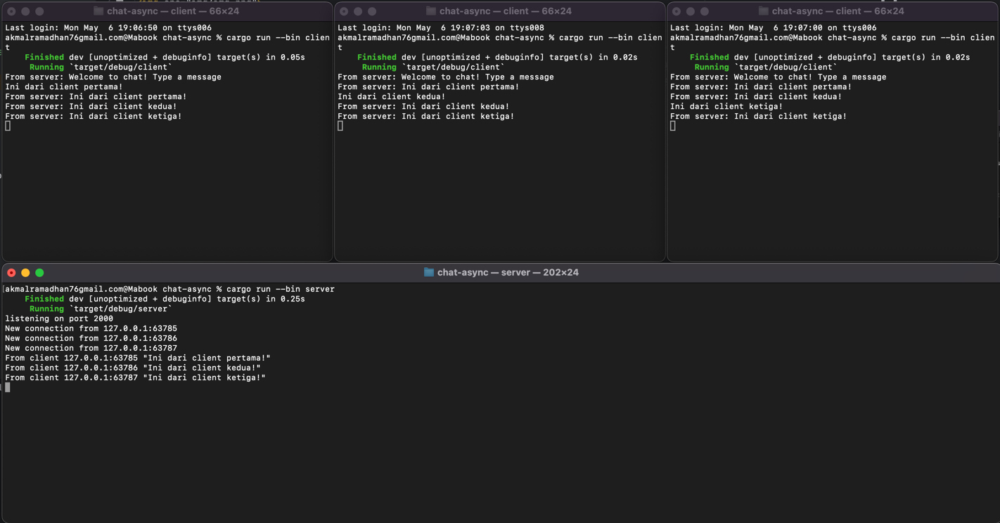

# Tutorial 9 - Advanced Programming - Brodcast Chat Application
**Akmal Ramadhan - 2206081534 - Kelas A**

## Original Code

_Clients_ dan _server_ berinteraksi melalui WebSocket. Jadi, ketika salah satu _client_ mengirim pesan, _server_ meneruskannya ke semua _clients_ yang terhubung. Hal ini menghasilkan efek _broadcast_ di mana pesan yang dikirim oleh satu _client_ diterima oleh semua _clients_ yang terhubung.
