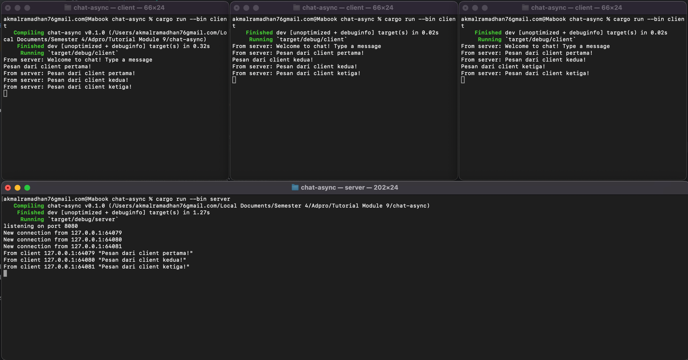
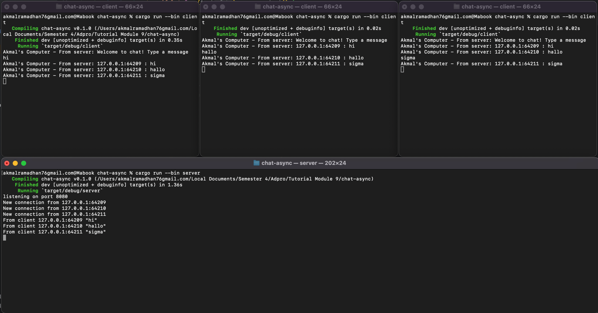

# Tutorial 9 - Advanced Programming - Brodcast Chat Application
**Akmal Ramadhan - 2206081534 - Kelas A**

## Original Code

_Clients_ dan _server_ berinteraksi melalui WebSocket. Jadi, ketika salah satu _client_ mengirim pesan, _server_ meneruskannya ke semua _clients_ yang terhubung. Hal ini menghasilkan efek _broadcast_ di mana pesan yang dikirim oleh satu _client_ diterima oleh semua _clients_ yang terhubung.

## Modifying the Websocket Port

Agar berjalan dengan baik, kita perlu mengubah kedua port (pada `client.rs` dan `server.rs`). Jika salah satu dari keduanya memiliki port yang berbeda satu sama lain, _client_ tidak akan dapat terhubung ke _server_ .

## Small Changes

Pada tahap ini, kita menambahkan informasi pengirim untuk setiap _client_ berupa IP dan Port. Hal ini memungkinkan _client_ untuk mengetahui siapa yang mengirim pesan.Perubahan ini dapat dilakukan dengan mengubah format `bcast_tx.send` pada `server.rs`.